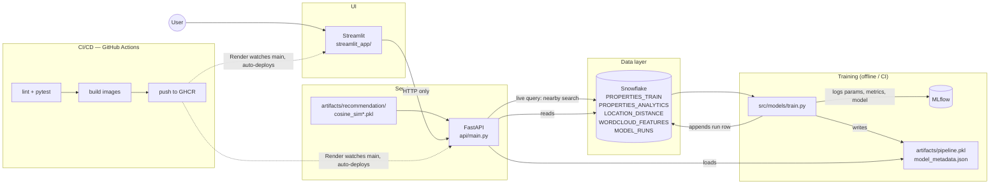

# Real Estate Intelligence Platform

An MLOps rebuild of a Gurgaon property price predictor: a Snowflake-backed training
pipeline with MLflow experiment tracking, a FastAPI model-serving layer, a Streamlit UI
that talks only to that API, both containerized, and a GitHub Actions pipeline that
lints, tests, and publishes versioned images on every push.

## Architecture



**Two containers, one job each.** The API image has scikit-learn/xgboost/Snowflake
connector; the Streamlit image has plotly/matplotlib/wordcloud. Neither needs what the
other has, and Snowflake credentials only ever live in the API's environment — the UI
never sees them.

## Why these choices

- **Snowflake as source of truth.** Training reads `PROPERTIES_TRAIN` from Snowflake
  (falls back to local CSV if unconfigured, so tests/CI never need live credentials).
  The "nearby property search" endpoint queries `LOCATION_DISTANCE` live per request —
  one batch-read path, one online-query path, both against the same warehouse.
- **XGBoost instead of the original 500-tree RandomForest.** The original model
  artifact was **140MB**; over GitHub's soft file-size limits and slow to ship in a
  container. A tuned `XGBRegressor` scores comparably on cross-validated R²/MAE (see
  `python -m src.models.train --compare` for the full 11-model bake-off this project's
  original notebook ran) at roughly 1% of the file size.
- **Recommendation similarity matrices stay static artifacts.** `cosine_sim*.pkl` and
  `location_distance.pkl` were built in the original project's EDA notebook, which
  isn't part of this repo — there's no source to regenerate them from, so they're
  versioned under `artifacts/recommendation/` rather than faked. `location_distance.pkl`
  is *also* loaded into Snowflake (melted to long form) so the nearby-search feature has
  a live-query path; the dense cosine-similarity matrices are not — they're precomputed
  embeddings, not naturally tabular.
- **Model self-trains on first boot if no artifact exists** (`src/models/predict.py`).
  `docker compose up` on a machine that has never trained a model will train once
  (from Snowflake if configured, else the bundled CSV sample) and cache the artifact in
  a named volume — no separate "train then build" step required to get a working demo.

## Repo layout

```
src/
  config.py              # all env-driven settings, no hardcoded paths
  data/
    snowflake_client.py  # read_table / write_table / query
    load_to_snowflake.py # one-time (re-runnable) ingestion job
    analytics_repo.py    # cached reads for the Analytics dashboard
  models/
    train.py             # training entrypoint, MLflow logging
    predict.py            # inference + lazy self-training
    recommend.py          # similarity + nearby-search
api/
  main.py                 # FastAPI app (all endpoints)
streamlit_app/
  Home_Page.py, pages/    # UI — HTTP client of the API only
tests/                    # offline, fixture-driven (no Snowflake needed)
docker/                   # Dockerfile.api, Dockerfile.streamlit
.github/workflows/        # CI/CD
```

## Local setup

```bash
python3.11 -m venv .venv && source .venv/bin/activate
pip install -r requirements/dev.txt
cp .env.example .env   # fill in Snowflake creds, or leave blank to use data/raw/*.csv
```

**Option A — with Snowflake** (recommended, this is the point of the project):
1. Sign up for the [Snowflake free trial](https://signup.snowflake.com/) (30 days /
   $400 credit, no card required for the trial itself).
2. Fill `.env` with `SNOWFLAKE_ACCOUNT`, `SNOWFLAKE_USER`, `SNOWFLAKE_PASSWORD`.
3. `make load-snowflake` — creates the warehouse/database/schema and loads the four
   tables from `data/raw/`.
4. `make train` — trains from Snowflake, logs to MLflow, writes `artifacts/pipeline.pkl`.

**Option B — offline**, no Snowflake account: leave the Snowflake vars in `.env` blank.
`make train` and the API both fall back to `data/raw/*.csv` automatically.

Then run everything:

```bash
make run-api      # http://localhost:8000  (docs at /docs)
make run-ui        # http://localhost:8501, separate terminal
```

or with Docker:

```bash
docker compose up --build
```

## Testing

```bash
make test
```

Runs offline against a 60-row fixture under `tests/fixtures/` — no Snowflake
connection, no network. This is exactly what CI runs on every push/PR.

## MLflow

```bash
mlflow ui --backend-store-uri file:./mlruns
```

Every `make train` run logs params (model type, hyperparameters, data source),
metrics (10-fold CV R², MAE), and the fitted pipeline as an MLflow artifact. If
Snowflake is configured, the run is also appended to a `MODEL_RUNS` table for
lineage — "which model version is in production, trained from which data, when."

## CI/CD

`.github/workflows/ci-cd.yml`:
1. **Every push/PR** — `ruff check` + `pytest` (offline, fixture-based).
2. **On push to `main`**, after tests pass — builds both Docker images and pushes
   them to GitHub Container Registry (`ghcr.io/<you>/<repo>/api` and `.../streamlit`,
   lowercased — GHCR rejects uppercase repository paths), tagged with both
   `latest` and the commit SHA.
3. **Deploy** — [Render](https://render.com) is connected directly to this GitHub repo
   and rebuilds/redeploys both services on every push to `main` once checks pass (see
   below). GHCR publishing is kept as its own step regardless, so there's a versioned,
   pullable image history independent of what Render happens to be running.

### Deploying to Render

1. Push this repo to GitHub (see below).
2. In Render: **New → Web Service**, connect the repo, set:
   - Dockerfile path: `docker/Dockerfile.api`, add the Snowflake + `MLFLOW_*` env vars
     from `.env`.
3. Repeat: **New → Web Service** with Dockerfile path `docker/Dockerfile.streamlit`,
   env var `API_URL` = the first service's public Render URL.
4. Enable auto-deploy on push for both — that's the CD half of the pipeline.

### Pushing to GitHub

```bash
git remote add origin <your-repo-url>
git branch -M main
git push -u origin main
```

## API reference

Interactive docs at `/docs` once the API is running. Summary:

| Endpoint | Purpose |
|---|---|
| `GET /health` | Liveness check |
| `GET /metadata/options` | Dropdown values for the prediction form |
| `GET /metadata/model` | Currently loaded model's version/metrics |
| `POST /predict` | Price prediction |
| `GET /recommend/options` | Property/landmark lists |
| `GET /recommend/similar` | Content-based similar properties |
| `GET /recommend/nearby` | Live Snowflake query: properties near a landmark |
| `GET /analytics/*` | Data backing the Analytics dashboard |

## Resume framing

> Rebuilt a monolithic Streamlit ML app into a Snowflake-backed MLOps pipeline: FastAPI
> model-serving layer decoupled from the UI, MLflow experiment tracking, containerized
> with Docker, and a GitHub Actions CI/CD pipeline that lints, tests, and publishes
> versioned images to GHCR on every push, auto-deployed via Render.
